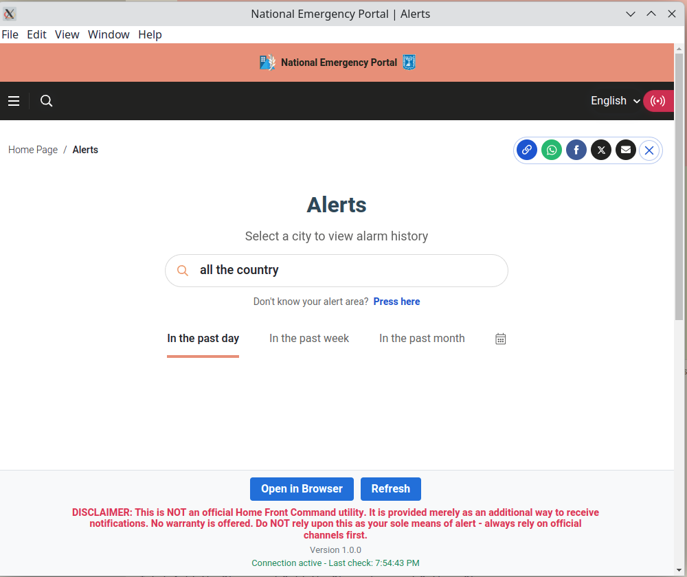

# HFC-Wrapper-Linux



An unofficial desktop wrapper for the Home Front Command emergency alerts system. This application provides a desktop interface for monitoring emergency alerts from https://www.oref.org.il/eng/alerts-history.

## Features

- Persistent connection to the HFC alerts website
- System tray integration for minimal desktop footprint
- Audio alerts enabled by default
- "Open in Browser" functionality
- Cross-platform compatibility via Electron and AppImage packaging

## Disclaimer

**This is NOT an official Home Front Command utility.** It is provided merely as an additional way to receive notifications. No warranty is offered. Do NOT rely upon this as your sole means of alert - always rely on official channels first.

## Requirements

- Node.js (v14 or later)
- npm (v6 or later)

## Installation

### Option 1: Run from source

1. Clone this repository:
   ```
   git clone https://github.com/yourusername/HFC-Wrapper-Linux.git
   cd HFC-Wrapper-Linux
   ```

2. Install dependencies:
   ```
   npm install
   ```

3. Run the application:
   ```
   npm start
   ```

### Option 2: Build AppImage (recommended for distribution)

1. Clone and install dependencies as above

2. Add a proper icon:
   - Replace the placeholder file in `assets/icon.png` with your own icon
   - The icon should be a PNG file with dimensions of at least 512x512 pixels

3. Build the AppImage:
   ```
   npm run make:appimage
   ```

4. The AppImage will be created in the `dist` directory

5. Make the AppImage executable:
   ```
   chmod +x dist/*.AppImage
   ```

6. Run the AppImage by double-clicking it or from the terminal

## Usage

- The application will start and display the HFC alerts website
- When minimized, the application will continue running in the system tray
- Click on the system tray icon to show the application
- Right-click on the system tray icon for additional options, including Quit
- Use the "Open in Browser" button to open the website in your default browser

## Development

### Project Structure

- `main.js` - Main Electron application file
- `preload.js` - Preload script for secure IPC communication
- `inject.js` - Script injected into the webpage to add custom UI elements
- `assets/` - Directory containing application assets

### Building for Other Platforms

The application is configured to build AppImages for Linux by default. To build for other platforms, modify the `build` section in `package.json`.

## License

MIT
